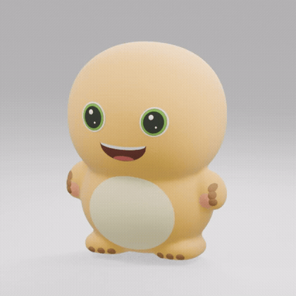

# 🫧 Squishy · Make your favorite thing squishable

[中文](README.md)

**A tiny, softer version of something you love.**

Your cat's unimpressed face. A cake too cute to eat. That little creature you drew in the corner of your notebook. Give your AI assistant a picture and turn it into a plump digital squishy: press it down, let go, and watch it take its sweet time coming back.

No modeling lessons first. Just a picture and a small excuse to take a break.


**[Give the demo a squeeze →](https://everettfish.github.io/squishy-skill/)** · [See the turnaround](examples/nailong/turnaround.png) · [Take home the Blender model](examples/nailong/toy.blend)



## What would you squeeze today?

### 🐈 Your cat, with fewer consequences

“Keep her grumpy face. Make the rest of her a little mochi.”

A small desk companion for long meetings. The digital cat recovers slowly; the real cat keeps sleeping.

### 🍰 The dessert you wanted to keep forever

A strawberry cake, a custard pudding, that slightly lopsided cookie you made yourself. Same charm, considerably fewer crumbs.

### 🦖 A day off for your character

Turn an original character, game NPC, or avatar into a soft little friend. Usually they save the world. Today their only job is to get squashed and slowly stand back up.

### 🎁 A small gift with no shipping address

“Make this bear squishable. Put ‘Take your time. I'm here.’ beside it.”

Play on a phone or computer. When you're ready to send a link, ask your assistant to publish it. Your photos aren't made public by default.

### ✏️ A second life for a doodle

A child's drawing. A sticky-note monster. A potato with suspicious intentions. It doesn't have to be polished to have personality.

## One picture. One small request.

> Use $squishy to turn this picture into a slow-rising squishy. First make a cute, rounded 3D turnaround in a cozy life-sim game style, then build the model. Give it a plain white page where I can press, rotate, and let it slowly recover.

Your assistant will:

1. **Find what makes it yours.** Keep its colours, expression, markings, and those little details that matter.
2. **Give it some volume.** Create consistent front, side, and back views before modeling. No paper-thin toy hiding behind a good camera angle.
3. **Make a soft little body.** Build an editable 3D model with a finely textured foam surface.
4. **Leave room for a breather.** Open a quiet white page. Hold, release, and watch it puff back up.

People, animals, and characters get the mochi treatment by default: round heads, plump bellies, tiny limbs, and plenty of volume from the side. Let go for a little soft jiggle, followed by a slow rise. The Blender project includes a playable version of that same squishy motion.

No oversized logo, busy dashboard, or decorative tech labels. Just your little thing, being soft.

## Put it in your assistant's pocket

Squishy is an open-source **Skill for AI assistants**, not another app to sign up for.

**Codex:** clone this repository into `~/.codex/skills/squishy`, then start a new session.

```sh
git clone https://github.com/EverettFish/squishy-skill.git ~/.codex/skills/squishy
```

**Claude Code or another skills-aware assistant:** use its skill directory, such as `~/.claude/skills/squishy`. In environments without a skill loader, ask the assistant to read `SKILL.md` and follow the workflow.

Then upload a picture and say: “Make this squishable.”

### You don't need to collect all the tools first

- **Image generation available?** The assistant uses the tools it actually has. In Codex / ChatGPT, that means the built-in imagegen tool when callable; elsewhere, the available image generator.
- **No image generator?** It works from your original image instead of stopping to ask for a paid API key.
- **No Blender?** It looks for an existing installation, then downloads and verifies an official portable copy into your user directory when needed.

Your computer must be able to run Blender, and your assistant needs permission to execute code and read/write files. Once built, the toy doesn't need image-generation credits or an online API to play.

## What comes home with you?

- A cute turnaround sheet, when image generation is available.
- A genuinely three-dimensional squishy with a front, sides, and back.
- An editable Blender file and its construction script.
- A clean little webpage that works on phones and computers.
- A small comforting line, if you'd like one.

The assistant interprets your picture and builds a toy from it. Intricate characters, transparent objects, and heavily obscured photos may take a few rounds. This is a playful digital squishy, not an exact 3D scan or a manufacturing-ready physical toy.

## Bring more weird little things

Cats, bread, mysterious creatures: contributions and examples are welcome. The aim is simple: **more recognisable, more rounded, more satisfying to squeeze—and less interface.**

If you'd like to tinker, start with [SKILL.md](SKILL.md), browse the [references](references), or adapt the [viewer template](assets/web). If you'd just like a toy, upload a picture.

Code and skill instructions are [MIT licensed](LICENSE). Nailong belongs to its respective rights holders; the demonstration assets do not grant commercial rights to that character. Your uploaded images remain yours or their original owners'. See [asset notes](ASSETS.md).

May the only thing that needs to bounce back today be your squishy.
