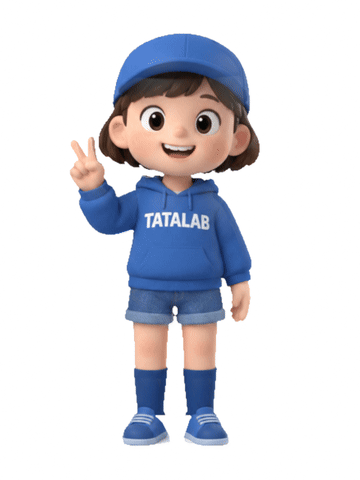

# 🫠 Squishy · Make everything a little unhinged

[简体中文](README.md)

**Turn anything into something sticky, stretchy, and deeply unserious.**

Upload a picture. Let your AI assistant give it a 3D body you can poke, knead and pull into questionable shapes. Push one spot in. Stretch a cheek out. Let go and watch it slowly negotiate its way back to normal.

Turn a willing friend's avatar into a rat-jerky squishy. Pull your profile picture into a noodle. Flatten the metaphorical cake your boss keeps promising. Dignity is optional. Another squish is inevitable.

**[Try it on TATA →](https://everettfish.github.io/squishy-skill/tata/)** · **[Nailong isn't safe either →](https://everettfish.github.io/squishy-skill/)** · [Reference vs. model](https://everettfish.github.io/squishy-skill/tata/likeness.html)



## A few questionable uses

### 🐀 Your friend, now available as rat jerky

Use an image your friend is happy for you to play with:

> Make this character a ridiculous rat-jerky squishy. Keep the face recognizable, but let the body get weird. I want to grab a cheek, stretch it out and watch it wobble back.

Being a person is exhausting. Try being a stretchy little goblin for a minute. “Rat jerky” is an art-direction joke, not a built-in rat filter: tell the assistant what kind of strange you're after.

### 🫓 Give your avatar a difficult afternoon

Your profile picture handles professionalism. Its squishy double handles whatever this is. Round before the meeting, suspiciously bookmark-shaped afterward. Give it a moment to recover.

### 🍮 Remove a dessert's structural dignity

Pudding, cake, cream puffs, an innocent potato. It looks edible. It stretches like it absolutely shouldn't. Digital food: no crumbs, no calories, several unanswered questions.

### 🦖 Let a character leave its normal state

An original mascot, a tiny monster, an avatar. Still recognizable at rest. Increasingly debatable once you get your hands on it.

## Start the nonsense

This is an open-source **Skill for AI assistants**, not another app to sign up for.

```sh
git clone https://github.com/EverettFish/squishy-skill.git ~/.codex/skills/squishy
```

For Codex, reopen your session after installing in `~/.codex/skills/squishy`. Other Skills-compatible assistants can use their own directory, such as `~/.claude/skills/squishy`. An assistant with code execution can also read `SKILL.md` directly.

Upload a picture and say:

> Use $squishy to make this sticky and ridiculously bouncy. Let me press locally and grab a spot to pull it outward. Keep the face and clothes recognizable; the deformation doesn't have to be dignified. White, minimal webpage. No physics lecture beside the toy.

Ask explicitly for rat jerky, a mochi blob or another absurd redesign. **Without that request, identity still comes first. Weird physics is not permission to replace somebody's face.**

## What the assistant does

1. **Identify the subject of the experiment.** Keep its face, colours, clothes and distinctive details.
2. **Fill in the unseen bits.** Generate consistent reference views with an available image tool. Preserve already-finished 3D art; fall back to the original if generation is unavailable.
3. **Give it a deformable body.** Build volume, UV/projected textures and materials in Blender. Find an existing install first; otherwise download and verify an official portable release within the environment's permissions.
4. **Introduce it to your cursor.** A white page with Press, Pull, Rotate and optional feel controls. The parameters shouldn't get more attention than the thing being stretched.

You get a Blender project, build scripts, GLB, actual renders and a playable webpage, plus a reference sheet when generation is available. Playing needs no online image API. Publishing your link or source material is your choice.

## How the sticky part works

A little implementation detail for people who want to make the situation worse, productively:

| Part | Implementation |
|---|---|
| Image reference | Uses real, callable image tools such as built-in imagegen, or falls back to the original. No invented image-to-3D service. |
| Blender geometry | Subject-specific Python builds volume, UV/projection textures and materials. Finished 3D references retain their details instead of getting a stock doll face. |
| Local pressing | Raycast a surface, map back to rest coordinates, then apply a compact smooth deformation kernel. Nearby material bulges; distant vertices don't scale. |
| Pulling | Cursor motion on a grab plane plus an outward normal component. Eyes, lettering and clothing textures move with the same surface. |
| Bounce and delay | A damped oscillator handles fast response and release wobble; a slowly decaying memory term reluctantly returns to rest. |
| Surface appearance | Foam/gel Physical Material for ordinary models. Baked reference textures keep their original colours, with relative-normal shading to make dents readable. |
| Browser | Static Three.js, local dependencies. No logo or technical dashboard. Press, Pull, Rotate. |

The Blender timeline also includes a local press/pull/release demonstration. The webpage calculates interaction live; the timeline is editable animation, not a Blender soft-body simulation cache.

## Weird, yes. Precision simulation, no.

This is a **reduced-order viscoelastic approximation**, not FEM, fluid dynamics, self-collision or strict volume conservation. Extreme pulls can fold or intersect surfaces. Sometimes the result is deeply odd. This README is no longer pretending every output is a pristine, adorable collectible.

Image-to-model also needs subject-specific work; it isn't an automatic scan. TATA uses the original texture for front appearance, with inferred side/back volume and supporting reference textures. Side views can show projection stretching. One image cannot establish an identical appearance from every unseen angle.

Say “preserve the face and proportions” when likeness matters, or explicitly ask for a ridiculous body redesign. Inspectable, editable and playable beats pretending the reconstruction is perfect.

## Adjust the level of wrong

```sh
python scripts/ensure_blender.py --search-root /your/workspace
python scripts/init_project.py /your/new-toy --name "A Friend's Temporary Form" --lang en
# Put the model at /your/new-toy/web/assets/toy.glb
python scripts/serve.py /your/new-toy/web --port 4173
```

`web/toy.json` controls name, model URL, language, accent and `material: "gel"` or `"foam"`. Use `referenceTexture: true` for baked reference imagery. Appearance and deformation are separate choices.

- [Blender configuration](references/blender-configuration.md): discovery/install, axes, materials, renders, projected text, animation and export.
- [Likeness and textures](references/likeness-and-textures.md): don't accidentally turn your friend into a stranger.
- [Interaction parameters](references/interaction.md): support radius, damping, memory and limits.
- [TATA example](examples/tata/NOTES.md) · [Web template](assets/web) · [Modeling helpers](scripts/blender_helpers.py).

```sh
node --test tests/physics.test.mjs tests/gel.test.mjs
python -m unittest discover -s tests
```

Bring strange pictures, questionable results and useful fixes to Issues. Code and instructions are [MIT licensed](LICENSE); character, trademark and asset rights remain with their owners. See [asset notes](ASSETS.md).

**Give it a pull. Dignity can come back later.**